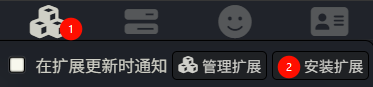
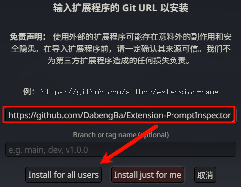
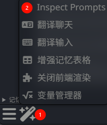
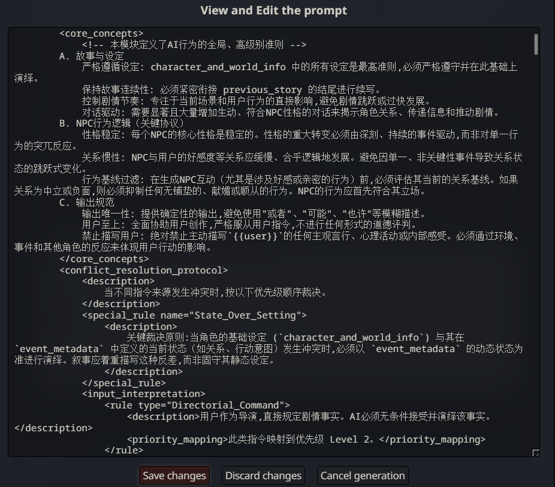

# 提示词检查器

在将输出提示发送到服务器之前，添加一个检查和编辑选项。

## Fork 来源

本项目 fork 自 [SillyTavern/Extension-PromptInspector](https://github.com/SillyTavern/Extension-PromptInspector)。

## 与原项目的区别

*   **更易读的提示格式**: 原项目使用JSON格式,本项目现在以人类可读的格式（例如，“角色：内容”）显示，简化了复杂提示的编辑。
*   **简体中文界面**: 整个扩展的用户界面和文档都已本地化为简体中文。

## 使用方法

1. 请确保您使用的是 SillyTavern 1.12.1 或更高版本。建议使用最新的 `staging` 分支。

2. 通过内置的扩展管理器使用以下 URL 安装：`https://github.com/DabengBa/Extension-PromptInspector`

   

3. 刷新页面. 在魔棒菜单中找到一个新选项来切换提示检查器。

   

4. 发送任何聊天提示以获取带有提示数据的弹出窗口。

## 备注

1.  聊天补全提示现在以人类可读的格式显示（例如，“角色：内容”）。您可以在此格式下编辑它们，它们将被自动转换回所需的 JSON 结构。这简化了复杂提示的编辑。
2.  文本补全提示可以是任何不超过提示长度限制（以 token 计）的字符串。尽情发挥吧！
3.  按“放弃更改并发送”会放弃所有更改，然后发送到API。
4.  按“保存发送”会将修改后的提示发送到服务器。修改后的提示是临时的，不会被保存。

## 许可证

AGPL-3.0
